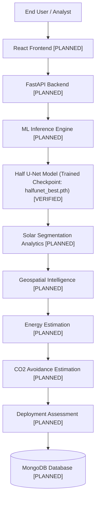

# Project Architecture: SolarMap-India

**Project Title:** SolarMap-India: AI-Based Geospatial Solar Intelligence for Solar Panel Mapping and Deployment Assessment  
**Document Status:** Architecture Foundation (Phase 0)  
**Last Updated:** Phase 0 Baseline  

---

## 1. Executive Overview

SolarMap-India is an AI-powered geospatial platform designed for detecting existing rooftop solar photovoltaic (PV) installations and evaluating potential solar deployment capacity across India using high-resolution satellite/aerial imagery.

The core computer vision engine is powered by a trained **Half U-Net** segmentation model that achieved state-of-the-art results during experimental evaluation (Test Dice/F1: **0.8742**, IoU: **0.7946**).

---

## 2. Planned Architecture Pipeline

The diagram below reflects the targeted end-to-end data and execution flow. **All downstream application components are currently PLANNED and not yet implemented.**

---

## 3. Component Status & Description

| Component | Status | Description |
| :--- | :--- | :--- |
| **User Interface** | `PLANNED` | Interactive web dashboard with map views, image upload, ROI selector, and analytics views. |
| **React Frontend** | `PLANNED` | React-based SPA (single-page application) with Leaflet/MapLibre mapping and Chart.js/Recharts visual analytics. |
| **FastAPI Backend** | `PLANNED` | Asynchronous REST API providing upload handling, model inference orchestration, geospatial queries, and reporting. |
| **ML Inference Engine** | `COMPLETE & VERIFIED` | Standalone, lightweight inference module executing PyTorch tensor preprocessing, model forward pass, and mask postprocessing. |
| **Half U-Net Model** | `VERIFIED` | 2-class semantic segmentation architecture trained on 2500 aerial images (640x640 / resized to 256x256). Checkpoint verified at `outputs/HalfUNet/models/halfunet_best.pth`. |
| **Solar Segmentation Analytics** | `COMPLETE & VERIFIED` | Converts raw probability masks into strictly derived pixel metrics, connected components, bounding boxes, centroids, filtering, and machine-readable JSON/CSV reports. |
| **Confidence & Uncertainty Analysis** | `COMPLETE & VERIFIED` | Computes per-pixel softmax probability maps, prediction confidence, probability-derived uncertainty, 10-bin histograms, and region-level confidence categorization. |
| **Geospatial Intelligence** | `LEVEL B (COMPLETE)` | Maps images to ground coordinates via sample catalog; audited physical scale availability (GSD absent -> physical area in m^2 marked insufficient_data; energy readiness BLOCKED). |
| **Energy Estimation** | `PLANNED (BLOCKED)` | Estimates annual kWh generation potential based on panel area, panel efficiency, standard solar irradiance (GHI/DNI), and system performance ratio. |
| **CO2 Estimation** | `PLANNED` | Estimates metric tons of greenhouse gas ($CO_2$) emissions avoided per year using regional grid emission factors (e.g., CEA baseline factors for India). |
| **Deployment Assessment** | `PLANNED` | Rooftop/ground suitability assessment, roof orientation, shading impact assessment, and deployment recommendation scoring. |
| **MongoDB** | `PLANNED` | Persistent document storage for prediction records, uploaded metadata, polygon masks, and user evaluation history. |

---

## 4. Scientific Requirements and Principles

To ensure scientific rigor and prevent misleading outputs, all future analytical modules must adhere to the following 10 foundational principles:

1. **Solar segmentation is the primary ML task:** The machine learning model is exclusively trained to segment solar panels from imagery; downstream energy and environmental metrics are analytical derivations, not direct model predictions.
2. **Pixel area is not automatically physical area:** Pixel counts cannot be directly treated as square meters without calibrating spatial scale.
3. **Physical area requires spatial resolution:** Calculating physical area ($m^2$) strictly requires the Ground Sampling Distance (GSD in meters/pixel) or geographic bounding coordinates.
4. **Energy generation is an estimate:** Photovoltaic electricity generation calculations ($E = A \cdot \eta \cdot G \cdot PR$) are model-based estimates and must clearly disclose assumptions regarding solar irradiance ($G$), panel efficiency ($\eta$), and performance ratio ($PR$).
5. **CO2 avoidance is an estimate:** Carbon offset metrics depend on regional grid emission factors (e.g., CEA India Grid Emission Factor ~0.71–0.82 kg $CO_2$/kWh) and are estimates subject to grid composition changes.
6. **Model confidence is not model accuracy:** Softmax/sigmoid probability scores indicate network activation confidence, not factual correctness. High confidence can still occur on out-of-distribution false positives.
7. **Geographic coordinates must come from actual data or explicit user input:** Coordinates must be extracted from genuine image metadata (GeoTIFF/EXIF), official datasets, or explicit user geocoding—never fabricated or assumed.
8. **Deployment suitability requires additional data:** Assessment of installation feasibility requires structural, tilt, azimuth, local shading, and electrical grid access parameters beyond 2D satellite segmentation alone.
9. **No unsupported scientific claims should be made:** Every report and UI metric must cite the formula, data source, and assumptions used.
10. **No fake values should be used in production:** If spatial resolution, irradiance, or location metadata is unavailable, the system must report "Unknown / Insufficient Data" rather than generating mock metrics.

---

## 5. Solar Segmentation Analytics Layer (Phase 2)

The Phase 2 analytics layer directly transforms raw 2D binary segmentation masks into discrete, mathematically validated geometric and statistical measurements.

### 5.1 Metrics Definition & Scope

- **Total Pixels ($W \times H$):** Exact spatial pixel count of the analyzed raster image.
- **Solar Pixels:** Count of pixels where $\text{mask} == 1$ (derived directly by integer counting).
- **Background Pixels:** Count of pixels where $\text{mask} == 0$. Verified: $\text{solar\_pixels} + \text{background\_pixels} \equiv \text{total\_pixels}$.
- **Solar Pixel Coverage (%):** $(\text{solar\_pixels} / \text{total\_pixels}) \times 100$.
  - *What it means:* Proportion of image pixel raster classified as photovoltaic panel surface.
  - *What it does NOT mean:* Rooftop area, physical panel area ($m^2$), or generation capacity.
- **Connected Components (8-connectivity):** Individual contiguous clusters of solar pixels isolated via raster component analysis.
  - *Bounding Box:* Minimum bounding rectangle $[x, y, w, h]$ in 2D image coordinates.
  - *Centroid:* Spatial center of mass $[\bar{x}, \bar{y}]$ in pixel coordinates (not geographic coordinates).
- **Component Filtering ($\text{min\_component\_area}$):** Configurable threshold (default: 20 pixels) to filter isolated pixel noise artifacts while preserving genuine panel clusters. Reports raw count, filtered count, and percentage of retained solar pixels.
- **Region Density:** Number of filtered solar regions divided by total image pixels ($\text{regions} / \text{pixel}$).

### 5.2 Scientific Limitations & Physical Constraints
- **Absence of Ground Sampling Distance (GSD):** Because dataset images currently lack calibrated spatial resolution (meters/pixel), no pixel-to-meter conversion is performed.
- **No Physical Claims:** No estimates of square meters ($m^2$), kilowatt-peak ($kW_p$), annual megawatt-hours ($MWh$), or tons of avoided $CO_2$ are generated at this layer.

---

## 6. Confidence & Uncertainty Analysis Layer (Phase 3)

The Phase 3 analytical layer evaluates model output probabilities and prediction ambiguity directly from the neural network's softmax distribution.

### 6.1 Mathematical Formulations
- **Softmax Probabilities:** For each pixel, $P(\text{background}) + P(\text{solar}) \equiv 1.0$, verified with numerical tolerance $\epsilon < 10^{-4}$.
- **Prediction Confidence:** 
  $$\text{Confidence}(x, y) = \max\left(P(\text{background}), P(\text{solar})\right) \in [0.5, 1.0]$$
- **Prediction Uncertainty (Ambiguity):**
  $$\text{Uncertainty}(x, y) = 1.0 - \text{Confidence}(x, y) \in [0.0, 0.5]$$
  Pixels near $0.5$ confidence exhibit maximum prediction ambiguity, whereas pixels near $1.0$ indicate strong model activation.
- **Confidence Distribution:** Evaluated across a 10-bin deterministic histogram $[0.0, 0.1), \dots, [0.9, 1.0]$.
- **Ambiguity Regions:** Configurable uncertainty threshold (default: $\text{Uncertainty} \ge 0.40$, corresponding to $\text{Confidence} \le 0.60$).

### 6.2 Region-Level Confidence Integration
- Integrates directly with Phase 2 connected solar components without altering region geometries.
- For each retained component, extracts localized mean, median, min, max, and standard deviation of solar probability and confidence.
- **Operational Categories:**
  - **HIGH:** $\text{Mean } P(\text{solar}) \ge 0.90$
  - **MEDIUM:** $0.70 \le \text{Mean } P(\text{solar}) < 0.90$
  - **LOW:** $\text{Mean } P(\text{solar}) < 0.70$

### 6.3 Scientific Limitations
- **Not Calibrated Accuracy:** Softmax confidence scores indicate network activation strength, not empirically calibrated empirical accuracy or Bayesian posterior probability.
- **Not Epistemic/Aleatoric Uncertainty:** The uncertainty metric measures decision boundary ambiguity, not formal Monte Carlo dropout or ensemble epistemic variance.

---

## 7. Geospatial & Physical Area Foundation (Phase 4)

Phase 4 evaluated the scientific legitimacy of converting 2D image-space detections into geographic coordinates and physical areas ($m^2$).

### 7.1 Dataset Metadata Audit & Georeferencing Classification
- **Georeferencing Classification:** **LEVEL B** (*Per-image geographic coordinates available; physical pixel scale unavailable*).
- **Image-to-Coordinate Mapping:** Every image in the default dataset ($2,505$ files) was deterministically matched ($100\%$ match rate, $0$ unmatched) to ground coordinates in `EI_train_data(Sheet1).csv` and `splits/dataset_manifest.csv` via the validated naming pattern `<sampleid>[.0]_1[.0].png`.
- **Coordinate Boundaries:** All positive solar images ($2,531$ records) are concentrated in Gujarat, Western India (lat: $21.05^\circ \text{N}$ to $23.45^\circ \text{N}$, lon: $70.06^\circ \text{E}$ to $73.19^\circ \text{E}$). Exactly 6 negative background images were identified outside the mainland India bounding box.
- **Component Coordinates:** NOT supported; individual solar panel centroids cannot be legitimately geocoded without an affine georeferencing transform matrix (absent in PNG format).

### 7.2 Physical Area & Energy Readiness
- **Absence of Ground Sampling Distance (GSD):** Raster metadata contains zero EXIF GPS tags, world files (`.tfw`/`.pgw`), or spatial resolution parameters.
- **Physical Area Status:** Marked strictly as `insufficient_data` (`area_m2 = null`), while preserving exact `area_pixels`. No arbitrary pixel-to-meter multipliers ($1\text{ px} = 1\text{ m}$, $0.5\text{ m}$, etc.) are permitted.
- **Energy Estimation Readiness:** **`BLOCKED`**. Downstream photovoltaic energy yield calculations ($E = A \cdot \eta \cdot G \cdot PR$) require physical square meters ($A$) and are halted until calibrated GSD metadata or imagery is integrated.

---

## 8. External Spatial Resolution & Solar Resource Foundation (Phase 5)

Phase 5 investigated whether legitimate external or embedded sources can provide the two required inputs for physical solar energy estimation:
1. Physical spatial resolution / Ground Sampling Distance (GSD)
2. Authoritative solar resource (irradiance/irradiation) data

### 8.1 Empirical Imagery Source & GSD Audit
- **Source Platform & Provider:** UNKNOWN / UNDOCUMENTED in dataset manifests and headers.
- **COCO Metadata:** Header `info` fields in `merged_instances_default.json` are blank strings (`contributor`, `description`, `url`, `version`, `year` all empty).
- **Embedded Rasters:** Standard 8-bit PNG images contain 0 embedded EXIF tags, 0 pHYs resolution chunks, 0 georeferencing tags, and 0 ESRI world files (`.tfw`/`.pgw`).
- **Spatial Resolution Status:** **`UNAVAILABLE`** (`gsd_meters = null`).
- **Strict No-Fabrication Policy:** Arbitrary resolution assumptions ($1\text{ px} = 1\text{ m}$, $0.5\text{ m/px}$, or generic Sentinel-2 $10\text{ m/px}$) are strictly rejected. Physical area ($m^2$) calculation remains blocked.

### 8.2 Solar Resource Acquisition (NASA POWER)
- **Source Selected:** NASA Langley Research Center — POWER Climatology Project (`SYN1DEG` / CERES).
- **API Endpoint:** `https://power.larc.nasa.gov/api/temporal/climatology/point`
- **Variable Retrieved:** `ALLSKY_SFC_SW_DWN` (All Sky Surface Shortwave Downward Irradiance).
- **Native Units:** $\text{kW-hr/m}^2/\text{day}$ ($\text{kWh/m}^2/\text{day}$).
- **Derived Annual Irradiation:** $\text{kWh/m}^2/\text{year} = \text{daily GHI} \times 365.25$.
- **Temporal Basis:** 20-Year Multi-Annual Climatology (January 2001 – December 2020).
- **Spatial Resolution:** $1.0^\circ \times 1.0^\circ$ native global grid ($\sim 110\text{ km}$).
- **Caching & Provenance:** Deterministic disk caching (`outputs/external_data/cache/`) keyed by coordinates and parameters; full scientific provenance recorded for every retrieval.
- **Primary Test Image (`768.0_1.0.png`):** Coordinates $(21.197148^\circ\text{N}, 72.780643^\circ\text{E})$ yielded $5.4041\text{ kWh/m}^2/\text{day}$ ($1,973.85\text{ kWh/m}^2/\text{year}$).

### 8.3 Energy Estimation Readiness
- **Status:** **`PARTIALLY_READY`** (Solar resource data is validated and available; physical spatial resolution remains UNAVAILABLE, blocking physical area derivation and final energy calculations).

---

## 9. Physical Area & Estimated Solar Energy Potential Foundation (Phase 6)

Phase 6 built the production-grade physical area and estimated solar energy potential modeling layer, enforcing strict scientific anti-fabrication standards.

### 9.1 Physical Area Methodology & GSD Reassessment
- **Mathematical Scaling:** For validated spatial scale, $\text{pixel\_area\_m2} = \text{GSD}^2$ (or $\text{GSD}_x \times \text{GSD}_y$). Physical panel area is $A = \text{solar\_pixels} \times \text{pixel\_area\_m2}$.
- **Empirical Status:** Because no sensor certificate, world file, or tile zoom level exists in the dataset, $\text{gsd\_status} = \text{"UNAVAILABLE"}$.
- **Enforced Result:** $\text{physical\_area\_status} = \text{"insufficient\_data"}$ and $\text{solar\_area\_m2} = \text{null}$. No heuristic multipliers (such as $1\text{ px} = 1\text{ m}$) are tolerated.

### 9.2 First-Order Photovoltaic Energy Model
- **Mathematical Formulation:**
  $$E = A \times \text{GHI} \times \eta \times \text{PR}$$
  where:
  - $E$: Estimated Solar Energy Potential ($\text{kWh/year}$)
  - $A$: Detected physical solar panel area ($m^2$)
  - $\text{GHI}$: Annual Global Horizontal Irradiation ($\text{kWh/m}^2/\text{year}$) derived from NASA POWER multi-annual climatology ($\text{daily GHI} \times 365.25$)
  - $\eta$: Photovoltaic module efficiency (fraction; configurable, benchmark commercial mono-Si $\sim 0.20$)
  - $\text{PR}$: System performance ratio (fraction; configurable, benchmark tropical rooftop $\sim 0.75$)
- **Scientific Labeling:** Outputs are strictly designated as **"Estimated Solar Energy Potential"** and never labeled "Actual Energy Generated".

### 9.3 Explicit Assumptions & Missing Input Behavior
- Parameters $\eta$ and $\text{PR}$ default strictly to `null`. Assumptions are never silently applied.
- If any input ($A$, $\text{GHI}$, $\eta$, $\text{PR}$) is `null`, the model returns $\text{energy\_status} = \text{"insufficient\_data"}$ and $\text{estimated\_energy\_kwh\_year} = \text{null}$.
- **Primary Test Sample (`768.0_1.0.png`):**
  - Solar pixels: $68,451 / 409,600$ ($16.71\%$ coverage)
  - Coordinates: $(21.197148^\circ\text{N}, 72.780643^\circ\text{E})$
  - Solar Resource: $1,973.85\text{ kWh/m}^2/\text{year}$ ($5.4041\text{ kWh/m}^2/\text{day}$)
  - Physical Area: `insufficient_data` (`null`)
  - Estimated Solar Energy Potential: `insufficient_data` (`null`)
  - Overall Phase 6 Readiness: **`BLOCKED`** (scientifically defensible due to uncalibrated raster GSD).

### 9.4 Comprehensive Qualitative Limitations
1. **Spatial Scale Uncertainty:** Ground Sampling Distance cannot be derived from image dimensions ($640 \times 640$ px does not equal $640\text{ m} \times 640\text{ m}$).
2. **Segmentation Edge Ambiguity:** 2D pixel classifications are subject to edge resolution effects and confidence thresholds.
3. **Coarse Solar Climatology:** NASA CERES native grid is $1.0^\circ \times 1.0^\circ$ ($\sim 110\text{ km}$), omitting local microclimates.
4. **Orientation and Tilt Unknowns:** Satellite nadir view lacks 3D rooftop tilt and compass azimuth angles.
5. **Loss Factors:** Local shading obstacles, soiling/dust accumulation, temperature derating coefficients, inverter clipping, and annual panel degradation ($\sim 0.5\%/\text{year}$) are not modeled.

